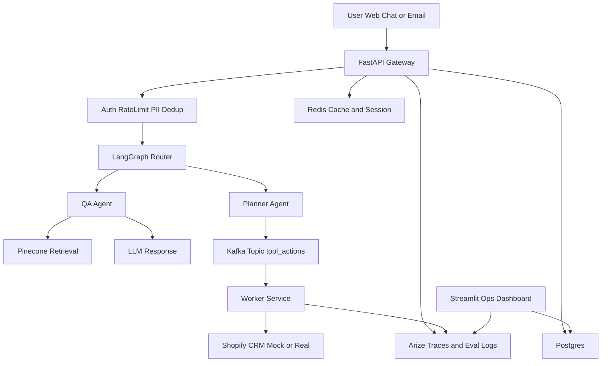
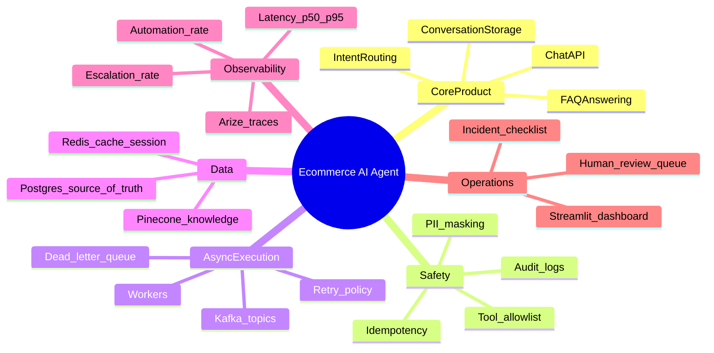

# 14-Day Beginner Roadmap: Production-Style Ecommerce AI Agent

This roadmap is written for a beginner who knows the stack but has not built a production project before.

Stack used:
- FastAPI
- Streamlit
- Redis
- Kafka
- LangChain + LangGraph
- Postgres
- Pinecone
- Arize AI

---

## 1) Big Picture First

You are not building everything in one go.
You are building in 3 layers:

1. **Working product layer** (it works end-to-end)
2. **Reliability layer** (it survives real usage)
3. **Production layer** (it is observable, measurable, improvable)

Your 14-day goal:
- Build a small but complete agent system.
- Keep architecture upgrade-friendly.
- Track real metrics: latency, automation rate, escalation rate.

---

## 2) Final Mini-Architecture (What You Will Reach in 14 Days)

---

## 3) Mind Map (Concept-Wise)

---

## 4) Rules You Must Follow Every Day

1. Build only one small, testable slice at a time.
2. Every feature must have:
   - happy path
   - failure path
   - log/tracing
3. Never call external tools without guardrails.
4. Postgres is source of truth. Redis is temporary.
5. If latency increases, move work to Kafka worker.

---

## 5) Day-by-Day Plan (14 Days)

## Day 1 - Project Setup and Local Environment
Goal: project runs locally with clean structure.

Tasks:
- Create folders:
  - `apps/api`
  - `apps/worker`
  - `apps/dashboard`
  - `services/router_agent`
  - `services/qa_agent`
  - `services/planner_agent`
  - `services/guardrails`
  - `libs/schemas`
  - `libs/observability`
  - `tests`
- Add `requirements.txt` and install dependencies.
- Create `.env.example` with all required keys.
- Run FastAPI with `/health` endpoint.

Done means:
- `GET /health` returns 200.
- App starts with one command.

---

## Day 2 - Database Modeling (Postgres)
Goal: define core entities and persistence.

Create tables:
- `users`
- `sessions`
- `messages`
- `intents`
- `tool_calls`
- `audit_logs`
- `escalations`

Tasks:
- Add SQLAlchemy models.
- Add DB connection manager.
- Add migration tool setup (Alembic optional, recommended).

Done means:
- You can create a user, session, and message from API code.

---

## Day 3 - Contracts and Schemas
Goal: stable request/response contracts.

Tasks:
- Pydantic models for:
  - `ChatMessageRequest`
  - `ChatMessageResponse`
  - `EmailIngestRequest`
  - `ToolActionEvent`
- Add strict validation and error responses.
- Add `request_id` in all API responses.

Done means:
- Invalid payloads fail with meaningful errors.

---

## Day 4 - Basic Gateway Guardrails
Goal: first safety layer in FastAPI.

Tasks:
- Add API key auth (simple version).
- Add Redis rate limiting.
- Add dedup by idempotency key.
- Add basic PII masking function before LLM calls.

Done means:
- Duplicate request does not create duplicate processing.
- Over-limit requests get blocked.

---

## Day 5 - Router Agent (LangGraph)
Goal: route each message to correct path.

Routing outputs:
- `faq`
- `order_status`
- `refund`
- `human_escalation`

Tasks:
- Implement LangGraph router node.
- Start with simple prompts + fallback rules.
- Save routed intent to DB.

Done means:
- One endpoint routes messages consistently.

---

## Day 6 - QA Agent + Pinecone Retrieval
Goal: answer FAQ from knowledge base.

Tasks:
- Create ingestion script for FAQs/policies to Pinecone.
- Build retrieval function with top-k contexts.
- QA agent generates grounded response.
- Save source chunk IDs in logs/audit.

Done means:
- FAQ query returns relevant answer with retrieved context.

---

## Day 7 - End-to-End Vertical Slice (First Milestone)
Goal: complete sync flow from request to response.

Flow:
- API receive
- guardrails
- routing
- QA answer
- DB save
- API return

Tasks:
- Add integration test for this full path.
- Record latency for each step.

Done means:
- One full “chat FAQ” journey works reliably.

---

## Day 8 - Planner Agent and Tool Contract
Goal: define action flow, do not execute heavy tools in sync path.

Tasks:
- Planner outputs structured plan:
  - action type
  - required params
  - risk level
  - approval needed or not
- Add tool allowlist policy.
- Add policy checks before emitting actions.

Done means:
- Planner can produce safe machine-readable action plans.

---

## Day 9 - Kafka Producer + Worker Consumer
Goal: move long operations async.

Tasks:
- FastAPI produces event to `tool_actions` topic.
- Worker consumes event and processes it.
- Add `tool_actions_dlq` topic.
- Add retries with exponential backoff.

Done means:
- Async event leaves API and worker processes it end-to-end.

---

## Day 10 - Integrations (Mock then Real)
Goal: connect planner actions to Shopify/CRM style operations.

Tasks:
- Implement mock clients first:
  - `get_order_status`
  - `create_crm_ticket`
- Add timeout + failure handling.
- Persist result in `tool_calls` and `audit_logs`.

Done means:
- Action requests execute safely via worker and result is tracked.

---

## Day 11 - Human-in-the-Loop and Escalation
Goal: safe fallback for complex/low-confidence cases.

Tasks:
- Add escalation criteria:
  - low confidence
  - policy-sensitive intent
  - repeated failures
- Save escalation record in DB.
- Expose pending escalations in Streamlit.

Done means:
- Risky requests route to human queue instead of unsafe automation.

---

## Day 12 - Observability with Arize + Metrics
Goal: see what your system is doing in production terms.

Track:
- p50 latency
- p95 latency
- automation rate
- escalation rate
- failure rate per tool

Tasks:
- Add tracing events for API, router, QA, planner, worker.
- Log prompts (masked), outputs, and confidence safely.
- Send traces/evals to Arize.

Done means:
- You can diagnose where latency/errors happen.

---

## Day 13 - Load Testing and SLO Tuning
Goal: align with targets p50 < 1s, p95 < 2.5s.

Tasks:
- Run load tests for FAQ flow.
- Identify slowest segment.
- Apply improvements:
  - Redis cache for hot FAQs
  - shorter prompt templates
  - timeout boundaries
  - fallback response when retrieval/LLM slow

Done means:
- Baseline SLO report generated with bottleneck notes.

---

## Day 14 - Production Readiness and Demo
Goal: convert prototype into deployable v1.

Tasks:
- Prepare runbook:
  - startup steps
  - rollback plan
  - incident checklist
- Add README sections:
  - architecture
  - env setup
  - how to run API/worker/dashboard
  - metrics definitions
- Record short demo scenarios:
  - FAQ automation
  - async order status
  - escalation case

Done means:
- Anyone can run project and understand system behavior.

---

## 6) What to Build First vs Later

Build now:
- One strong FAQ flow
- One async action flow
- One human escalation flow
- Full observability on these three

Build later:
- Multi-tenant support
- Complex multi-agent chains
- Advanced memory systems
- Multi-region infra

---

## 7) Beginner Mistakes to Avoid

1. Starting with too many features.
2. Using Kafka before defining event schema.
3. Logging everything without PII masking.
4. Treating Redis as permanent storage.
5. No idempotency on message/email events.
6. No audit trail for tool actions.

---

## 8) Daily Checklist Template (Use Every Day)

Copy this checklist each day:

- [ ] What is today’s single objective?
- [ ] Which API/schema/table changes are needed?
- [ ] What is happy path?
- [ ] What is failure path?
- [ ] What do I log/trace?
- [ ] How will I test this (unit + integration)?
- [ ] What metric should improve after this change?

---

## 9) Definition of Success After 14 Days

You win if:
- System handles FAQ autonomously.
- At least one tool action is async via Kafka worker.
- Escalation path exists and works.
- You can measure p50/p95 and automation rate.
- You can explain architecture confidently to interviewer/team.

---

## 10) Next Step After This Roadmap

After day 14, move to 2-week cycles:
- Week A: improve quality (routing, retrieval, prompts)
- Week B: improve reliability (timeouts, retries, tests, alerts)

Repeat this loop until automation rate and SLO targets are stable.

